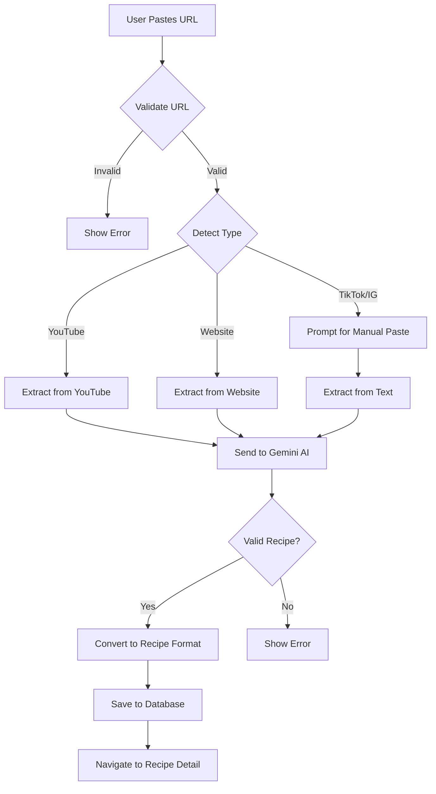

# DishFlow - Project Context Documentation

> **Last Updated:** 2026-01-24  
> **Version:** 1.0.0  
> **Repository:** https://github.com/unholy0X/dishflow.git

---

## Project Overview

**DishFlow** is a luxury bohème-styled React Native mobile application for managing recipes, pantry inventory, and shopping lists. The app features AI-powered recipe extraction from social media platforms and websites using Google's Gemini AI.

### Core Value Proposition
- Extract recipes from YouTube, Instagram, TikTok, and websites using AI
- Manage pantry inventory with expiration tracking
- Generate smart shopping lists from recipes
- Track cooking history and favorite recipes
- Beautiful, warm, artisanal design aesthetic

---

## Technology Stack

### Frontend Framework
- **React Native** 0.81.5 with **React** 19.1.0
- **Expo SDK** ~54.0.32 (managed workflow)
- **Expo Router** ~6.0.22 (file-based routing)

### Styling
- **NativeWind** 4.2.1 (Tailwind CSS for React Native)
- **Tailwind CSS** 3.4.19
- Custom luxury bohème design system

### State Management
- **Zustand** 5.0.10 (lightweight state management)
- Three separate stores: `recipeStore`, `pantryStore`, `shoppingStore`

### Database
- **Expo SQLite** ~16.0.10 (local-first architecture)
- SQLite with WAL mode and foreign keys enabled

### AI Integration
- **@google/generative-ai** 0.24.1
- Model: `gemini-2.0-flash` for fast recipe extraction

### Icons & UI
- **lucide-react-native** 0.563.0 (icon library)
- **react-native-gesture-handler** ~2.28.0
- **react-native-reanimated** ~4.1.1
- **react-native-safe-area-context** ~5.6.0

### Development
- **TypeScript** 5.9.2
- **Babel** with expo preset

---

## Project Structure

```
dishflow/
├── app/                          # Expo Router app directory
│   ├── (tabs)/                   # Tab navigation group
│   │   ├── _layout.tsx          # Tab bar configuration
│   │   ├── index.tsx            # Home screen
│   │   ├── recipes.tsx          # Recipes list screen
│   │   ├── pantry.tsx           # Pantry inventory screen
│   │   └── shopping.tsx         # Shopping list screen
│   ├── recipe/                   # Recipe-related screens
│   │   ├── [id].tsx             # Recipe detail (dynamic route)
│   │   ├── add.tsx              # Add recipe modal
│   │   └── manual.tsx           # Manual recipe entry
│   └── _layout.tsx              # Root layout
├── assets/                       # Static assets
│   ├── backgrounds/             # Bohème background images (boheme01-05.png)
│   ├── icon.png                 # App icon (1024x1024)
│   ├── splash.png               # Splash screen
│   └── adaptive-icon.png        # Android adaptive icon
├── constants/                    # Design system constants
│   ├── colors.ts                # Luxury bohème color palette
│   ├── typography.ts            # Font families, sizes, text styles
│   └── categories.ts            # Ingredient categories with icons
├── lib/                          # Core business logic
│   ├── database.ts              # SQLite operations & schema
│   ├── gemini.ts                # Gemini AI client setup
│   └── recipeExtractor.ts       # AI recipe extraction logic
├── store/                        # Zustand state management
│   ├── index.ts                 # Store exports
│   ├── recipeStore.ts           # Recipe state & actions
│   ├── pantryStore.ts           # Pantry state & actions
│   └── shoppingStore.ts         # Shopping list state & actions
├── types/                        # TypeScript type definitions
│   └── index.ts                 # All app types
├── .env                          # Environment variables (EXPO_PUBLIC_GEMINI_API_KEY)
├── app.json                      # Expo configuration
├── tailwind.config.js           # Tailwind/NativeWind config
├── tsconfig.json                # TypeScript configuration
├── babel.config.js              # Babel configuration
├── metro.config.js              # Metro bundler config
├── global.css                    # Global Tailwind directives
├── nativewind-env.d.ts          # NativeWind type definitions
└── package.json                  # Dependencies & scripts
```

---

## Database Schema

### Tables

#### `recipes`
```sql
CREATE TABLE recipes (
  id TEXT PRIMARY KEY,
  title TEXT NOT NULL,
  description TEXT,
  source_url TEXT,
  source_type TEXT,              -- 'youtube' | 'tiktok' | 'instagram' | 'website' | 'manual'
  thumbnail_url TEXT,
  prep_time INTEGER,             -- minutes
  cook_time INTEGER,             -- minutes
  servings INTEGER,
  difficulty TEXT,               -- 'easy' | 'medium' | 'hard'
  cuisine TEXT,
  tags TEXT,                     -- JSON array
  notes TEXT,
  is_favorite INTEGER DEFAULT 0,
  created_at TEXT NOT NULL,
  updated_at TEXT NOT NULL,
  cooked_count INTEGER DEFAULT 0,
  last_cooked_at TEXT
);
```

#### `ingredients`
```sql
CREATE TABLE ingredients (
  id TEXT PRIMARY KEY,
  recipe_id TEXT NOT NULL,
  name TEXT NOT NULL,
  amount REAL,
  unit TEXT,
  notes TEXT,
  is_optional INTEGER DEFAULT 0,
  category TEXT,                 -- 'produce' | 'dairy' | 'meat' | 'pantry' | 'spices' | 'other'
  sort_order INTEGER DEFAULT 0,
  FOREIGN KEY (recipe_id) REFERENCES recipes(id) ON DELETE CASCADE
);
```

#### `instructions`
```sql
CREATE TABLE instructions (
  id TEXT PRIMARY KEY,
  recipe_id TEXT NOT NULL,
  step_number INTEGER NOT NULL,
  text TEXT NOT NULL,
  duration INTEGER,              -- minutes
  image_url TEXT,
  FOREIGN KEY (recipe_id) REFERENCES recipes(id) ON DELETE CASCADE
);
```

#### `pantry_items`
```sql
CREATE TABLE pantry_items (
  id TEXT PRIMARY KEY,
  name TEXT NOT NULL,
  category TEXT NOT NULL,
  quantity REAL,
  unit TEXT,
  expires_at TEXT,
  notes TEXT,
  created_at TEXT NOT NULL,
  updated_at TEXT NOT NULL
);
```

#### `shopping_items`
```sql
CREATE TABLE shopping_items (
  id TEXT PRIMARY KEY,
  name TEXT NOT NULL,
  category TEXT NOT NULL,
  quantity REAL,
  unit TEXT,
  is_checked INTEGER DEFAULT 0,
  recipe_id TEXT,
  recipe_name TEXT,
  notes TEXT,
  created_at TEXT NOT NULL,
  FOREIGN KEY (recipe_id) REFERENCES recipes(id) ON DELETE SET NULL
);
```

### Indexes
- `idx_ingredients_recipe` on `ingredients(recipe_id)`
- `idx_instructions_recipe` on `instructions(recipe_id)`
- `idx_pantry_category` on `pantry_items(category)`
- `idx_shopping_checked` on `shopping_items(is_checked)`

---

## Design System

### Color Palette (Luxury Bohème)

#### Stone (Warm Beige/Cream)
```typescript
stone: {
  50: '#F7F3EE',   // Lightest cream - backgrounds
  100: '#EDE7DF',  // Light beige - cards
  200: '#D9CFC1',  // Medium beige - borders
  300: '#C4BBAB',  // Darker beige - disabled states
  400: '#B0A596',  // Darkest stone - muted elements
}
```

#### Honey (Golden Warmth)
```typescript
honey: {
  50: '#FFF9F0',   // Lightest honey - subtle backgrounds
  100: '#F7E7D0',  // Light honey - highlights
  200: '#E5C89A',  // Medium honey - accents
  300: '#D4B076',  // Warm honey - secondary CTAs
  400: '#C19A6B',  // Deep honey - primary CTAs
}
```

#### Sage (Muted Olive/Green)
```typescript
sage: {
  50: '#E8E7E2',   // Lightest sage - subtle backgrounds
  100: '#C5C3B8',  // Light sage - secondary elements
  200: '#9D9A8C',  // Medium sage - borders
  300: '#7D7A68',  // Darker sage - text
}
```

#### Text Hierarchy
```typescript
text: {
  primary: '#2B2822',    // Main text - warm dark brown
  secondary: '#4A443D',  // Secondary text
  tertiary: '#6B6456',   // Tertiary text
  muted: '#8D8577',      // Muted text
  disabled: '#ADA396',   // Disabled text
}
```

### Typography

#### Font Families
- **Display/Headers:** Cormorant Garamond (elegant serif)
- **Body/UI:** Inter (clean sans-serif)
- **Accent/Special:** Crimson Text (for quotes)

#### Type Scale
```typescript
fontSize: {
  xs: '12px',
  sm: '14px',
  base: '15px',
  md: '16px',
  lg: '18px',
  xl: '20px',
  '2xl': '24px',
  '3xl': '28px',
  '4xl': '32px',
  hero: '40px',
}
```

#### Text Styles (Presets)
```typescript
textStyles: {
  heroTitle: { fontFamily: 'Cormorant Garamond', fontSize: 40, lineHeight: 48, color: text.primary },
  h1: { fontFamily: 'Cormorant Garamond', fontSize: 32, lineHeight: 40, color: text.primary },
  h2: { fontFamily: 'Cormorant Garamond', fontSize: 24, lineHeight: 32, color: text.primary },
  body: { fontFamily: 'Inter', fontSize: 15, lineHeight: 24, color: text.secondary },
  caption: { fontFamily: 'Inter', fontSize: 12, lineHeight: 16, color: text.muted },
}
```

### Spacing
- Base unit: 4px
- Common values: 8, 12, 16, 18, 20, 22, 24, 32, 40, 48px
- Generous padding: minimum 24px for sections

### Border Radius
- `sm`: 12px
- `md`: 16px
- `lg`: 20px
- `xl`: 24px
- `2xl`: 32px
- `full`: 9999px (circles)

### Shadows (Warm-toned)
```typescript
boxShadow: {
  soft: '0 2px 8px rgba(43, 40, 34, 0.08)',
  warm: '0 4px 12px rgba(43, 40, 34, 0.12)',
  glow: '0 8px 24px rgba(43, 40, 34, 0.16)',
  honey: '0 4px 16px rgba(193, 154, 107, 0.25)',
}
```

### Background Images
- **boheme01.png**: Corner florals - used in hero sections and empty states
- **boheme02.png**: Additional texture variant
- **boheme03.png**: Additional texture variant
- **boheme04.png**: Additional texture variant
- **boheme05.png**: Candlelight ambiance - used in CTA buttons and headers

**Usage Pattern:**
```tsx
<ImageBackground
  source={require('../../assets/backgrounds/boheme01.png')}
  style={{ borderRadius: 32, overflow: 'hidden' }}
  imageStyle={{ opacity: 0.15, borderRadius: 32 }}
  resizeMode="cover"
>
  {/* Content */}
</ImageBackground>
```

---

## State Management Architecture

### Zustand Stores

#### Recipe Store (`recipeStore.ts`)
```typescript
interface RecipeState {
  recipes: Recipe[];
  isLoading: boolean;
  error: string | null;
  
  loadRecipes: () => Promise<void>;
  addRecipe: (recipe) => Promise<Recipe>;
  updateRecipe: (id, updates) => Promise<void>;
  deleteRecipe: (id) => Promise<void>;
  toggleFavorite: (id) => Promise<void>;
  markAsCooked: (id) => Promise<void>;
  getRecipeById: (id) => Recipe | undefined;
}
```

#### Pantry Store (`pantryStore.ts`)
```typescript
interface PantryState {
  items: PantryItem[];
  isLoading: boolean;
  error: string | null;
  
  loadItems: () => Promise<void>;
  addItem: (item) => Promise<PantryItem>;
  updateItem: (id, updates) => Promise<void>;
  deleteItem: (id) => Promise<void>;
  getItemsByCategory: (category) => PantryItem[];
}
```

#### Shopping Store (`shoppingStore.ts`)
```typescript
interface ShoppingState {
  items: ShoppingItem[];
  isLoading: boolean;
  error: string | null;
  
  loadItems: () => Promise<void>;
  addItem: (item) => Promise<ShoppingItem>;
  toggleItem: (id) => Promise<void>;
  deleteItem: (id) => Promise<void>;
  clearChecked: () => Promise<void>;
  addRecipeToList: (recipe) => Promise<void>;
}
```

### Data Flow
1. **Initialization**: Root layout (`app/_layout.tsx`) loads all stores on mount
2. **User Action**: Component calls store action (e.g., `addRecipe()`)
3. **Database Update**: Store action calls database function
4. **State Update**: Store updates local state with optimistic UI
5. **Re-render**: Components subscribed to store automatically re-render

---

## AI Recipe Extraction

### Supported Platforms
- ✅ **YouTube**: Direct URL extraction
- ✅ **Websites**: Recipe blog/website extraction
- ⚠️ **TikTok**: Requires manual paste of description
- ⚠️ **Instagram**: Requires manual paste of description

### Extraction Flow



### Gemini AI Configuration
```typescript
model: "gemini-2.0-flash"
responseMimeType: "application/json"
responseSchema: RECIPE_SCHEMA
```

### Recipe Schema
```typescript
{
  title: string;
  description?: string;
  prepTime?: number;
  cookTime?: number;
  servings?: number;
  difficulty?: 'easy' | 'medium' | 'hard';
  cuisine?: string;
  ingredients: Array<{
    name: string;
    amount?: number;
    unit?: string;
  }>;
  instructions: Array<{
    stepNumber: number;
    text: string;
  }>;
  tags?: string[];
}
```

---

## Navigation Structure

### File-Based Routing (Expo Router)

```
app/
├── _layout.tsx                 # Root Stack Navigator
├── (tabs)/                     # Tab Group
│   ├── _layout.tsx            # Tab Navigator
│   ├── index.tsx              # Home (/)
│   ├── recipes.tsx            # Recipes (/recipes)
│   ├── pantry.tsx             # Pantry (/pantry)
│   └── shopping.tsx           # Shopping (/shopping)
└── recipe/
    ├── [id].tsx               # Recipe Detail (/recipe/:id)
    ├── add.tsx                # Add Recipe Modal (/recipe/add)
    └── manual.tsx             # Manual Entry Modal (/recipe/manual)
```

### Tab Configuration
- **Home**: House icon, warm honey active color
- **Recipes**: Book icon, recipe collection
- **Pantry**: Package icon, inventory management
- **Shopping**: Shopping basket icon, shopping lists

### Modal Screens
- `recipe/add`: Presentation modal for adding recipes
- `recipe/manual`: Presentation modal for manual entry

---

## Key Features

### 1. Recipe Management
- **Add from URL**: AI-powered extraction from YouTube/websites
- **Manual Entry**: Full recipe creation form
- **Favorites**: Toggle favorite status
- **Cooking Tracker**: Track how many times cooked
- **Tags & Categories**: Organize by cuisine, difficulty, tags

### 2. Pantry Inventory
- **Category Organization**: Produce, dairy, meat, pantry, spices, etc.
- **Quantity Tracking**: Amount and unit
- **Expiration Dates**: Track when items expire
- **Quick Add**: Suggested common items

### 3. Shopping Lists
- **Recipe Integration**: Add all recipe ingredients to shopping list
- **Smart Deduplication**: Combine duplicate items
- **Pantry Filtering**: Remove items already in pantry
- **Category Grouping**: Organize by store section
- **Check/Uncheck**: Mark items as purchased

### 4. AI Features (Future)
- **"What Can I Make?"**: Match recipes to pantry items
- **"What's for Dinner?"**: AI meal suggestions
- **Smart Substitutions**: Ingredient alternatives
- **Meal Planning**: Weekly meal calendar

---

## Environment Variables

```bash
# .env
EXPO_PUBLIC_GEMINI_API_KEY=your_gemini_api_key_here
```

**Setup:**
1. Get API key from Google AI Studio: https://aistudio.google.com/apikey
2. Create `.env` file in project root
3. Add key as shown above
4. Restart Expo dev server

---

## Development Workflow

### Installation
```bash
cd dishflow
npm install
```

### Running the App
```bash
# Start Expo dev server
npm start

# Run on iOS simulator
npm run ios

# Run on Android emulator
npm run android

# Run in web browser
npm run web
```

### Database Initialization
- Database is automatically created on first app launch
- Schema is initialized in `lib/database.ts`
- Data is persisted locally on device

### Hot Reload
- Metro bundler supports fast refresh
- Changes to `.tsx` files reload instantly
- Changes to `tailwind.config.js` require restart

---

## Type System

### Core Types (`types/index.ts`)

```typescript
export type IngredientCategory = 
  | 'produce' | 'dairy' | 'meat' | 'seafood' 
  | 'pantry' | 'spices' | 'frozen' | 'bakery' 
  | 'beverages' | 'condiments' | 'other';

export type RecipeSource = 
  | 'youtube' | 'tiktok' | 'instagram' 
  | 'website' | 'manual';

export interface Ingredient {
  id?: string;
  name: string;
  amount?: number;
  unit?: string;
  notes?: string;
  isOptional?: boolean;
  category?: IngredientCategory;
}

export interface Instruction {
  id?: string;
  stepNumber: number;
  text: string;
  duration?: number;
  imageUrl?: string;
}

export interface Recipe {
  id: string;
  title: string;
  description?: string;
  sourceUrl?: string;
  sourceType?: RecipeSource;
  thumbnailUrl?: string;
  prepTime?: number;
  cookTime?: number;
  servings?: number;
  difficulty?: 'easy' | 'medium' | 'hard';
  cuisine?: string;
  tags?: string[];
  notes?: string;
  isFavorite: boolean;
  createdAt: string;
  updatedAt: string;
  cookedCount: number;
  lastCookedAt?: string;
  ingredients: Ingredient[];
  instructions: Instruction[];
}

export interface PantryItem {
  id: string;
  name: string;
  category: IngredientCategory;
  quantity?: number;
  unit?: string;
  expiresAt?: string;
  notes?: string;
  createdAt: string;
  updatedAt: string;
}

export interface ShoppingItem {
  id: string;
  name: string;
  category: IngredientCategory;
  quantity?: number;
  unit?: string;
  isChecked: boolean;
  recipeId?: string;
  recipeName?: string;
  notes?: string;
  createdAt: string;
}
```

---

## Performance Considerations

### Database Optimization
- **WAL Mode**: Write-Ahead Logging for better concurrency
- **Indexes**: On foreign keys and frequently queried columns
- **Batch Operations**: Use transactions for multiple inserts
- **Lazy Loading**: Load recipes on demand, not all at once

### Image Optimization
- Background images are ~2.6MB each (optimized PNGs)
- Low opacity overlays (6-15%) minimize visual weight
- Images bundled via `require()` for optimization
- No runtime image processing

### State Management
- Zustand is lightweight (~1KB)
- No unnecessary re-renders (selector-based subscriptions)
- Optimistic UI updates for better UX

---

## Testing Strategy

### Manual Testing Checklist
- [ ] Add recipe from YouTube URL
- [ ] Add recipe from website URL
- [ ] Add recipe manually
- [ ] Edit recipe details
- [ ] Delete recipe
- [ ] Toggle favorite status
- [ ] Add pantry items
- [ ] Add shopping list items
- [ ] Check/uncheck shopping items
- [ ] Clear checked shopping items
- [ ] Add recipe to shopping list
- [ ] Test on iOS simulator
- [ ] Test on Android emulator

### Future Automated Testing
- Unit tests for database operations
- Integration tests for AI extraction
- E2E tests for critical user flows

---

## Known Limitations

### Current
1. **TikTok/Instagram**: Cannot extract directly from URLs (API limitations)
2. **Offline AI**: Requires internet for recipe extraction
3. **Image Upload**: No image upload for recipes yet
4. **Meal Planning**: Not implemented yet
5. **Recipe Matching**: "What Can I Make?" feature not implemented

### Future Enhancements
1. **Cloud Sync**: Backup recipes to cloud
2. **Recipe Sharing**: Share recipes with friends
3. **Nutrition Info**: Calculate nutritional values
4. **Timer Integration**: Built-in cooking timers
5. **Voice Input**: Voice-to-text for hands-free cooking

---

## Deployment

### iOS
```bash
# Build for iOS
eas build --platform ios

# Submit to App Store
eas submit --platform ios
```

### Android
```bash
# Build for Android
eas build --platform android

# Submit to Play Store
eas submit --platform android
```

### Configuration
- Bundle ID: `com.dishflow.app`
- App Name: `DishFlow`
- Version: `1.0.0`

---

## Troubleshooting

### Common Issues

#### 1. "No iOS devices available"
```bash
# Boot simulator manually
xcrun simctl boot "iPhone 17"
```

#### 2. Metro bundler cache issues
```bash
npx expo start --clear
```

#### 3. Gemini API errors
- Check API key in `.env`
- Verify API quota not exceeded
- Check network connection

#### 4. Database errors
- Delete app and reinstall to reset database
- Check SQLite syntax in `lib/database.ts`

#### 5. Background images not showing
- Ensure images use relative paths: `require('../../assets/backgrounds/boheme01.png')`
- Use inline `style` props, not `className` for ImageBackground
- Add `resizeMode="cover"` prop

---

## Design Philosophy

### Luxury Bohème Aesthetic
- **Warmth**: All colors have warm, golden undertones
- **Texture**: Subtle linen/canvas textures add tactility
- **Botanicals**: Dried herbs and wheat evoke artisanal kitchens
- **Minimalism**: Generous negative space, refined composition
- **Timelessness**: Classic serif typography, muted palette

### User Experience Principles
1. **Simplicity**: Minimal steps to accomplish tasks
2. **Delight**: Beautiful animations and transitions
3. **Clarity**: Clear visual hierarchy and typography
4. **Warmth**: Inviting, approachable, human-centered
5. **Craftsmanship**: Attention to detail in every interaction

---

## Contributing Guidelines

### Code Style
- Use TypeScript for all new files
- Follow existing naming conventions
- Use functional components with hooks
- Prefer const over let
- Use async/await over promises

### Commit Messages
```
feat: Add recipe sharing feature
fix: Resolve database migration issue
design: Update button hover states
docs: Add API documentation
refactor: Simplify recipe extraction logic
```

### Pull Request Process
1. Create feature branch from `master`
2. Make changes with clear commits
3. Test on both iOS and Android
4. Update documentation if needed
5. Submit PR with description

---

## License & Credits

### License
Proprietary - All rights reserved

### Credits
- **Design**: Luxury bohème aesthetic inspired by slow living and artisanal kitchens
- **AI**: Powered by Google Gemini 2.0 Flash
- **Icons**: Lucide React Native
- **Fonts**: Cormorant Garamond, Inter, Crimson Text

---

## Contact & Support

- **Repository**: https://github.com/unholy0X/dishflow.git
- **Issues**: Create GitHub issue for bugs/features
- **Email**: [Your contact email]

---

**End of Project Context Documentation**
